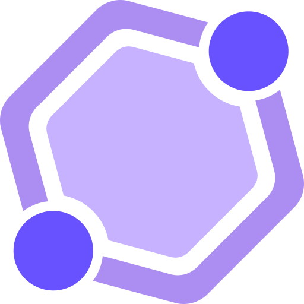

<div id="top"></div>

<!-- PROJECT Intro -->
<br />
<div align="center">
  <a href="https://gho-lens.vercel.app" target="_blank">
    
  </a>
</div>

<!-- ABOUT THE PROJECT -->

## GHO Lens

## Overview

GHO Lens is a transformative open-source project born out of the **LFGHO Hackathon** organized by **ETHGlobal**. It serves as a comprehensive data hub, providing information on the **GHO** Stablecoin and its ecosystem. With a focus on accessibility and a seamless user interface, it aims to bring clarity and insight - just like a **lens** - into the world of DeFi.

Currently, GHO Lens provides detailed data insights. Looking ahead, it aims to go beyond observation. Future plans include letting users actively participate in markets by offering collateral and borrowing.

## Tech Stack

-   **Next.js 14:** Taking advantage of the latest features and improvements for a modern and optimized web application.

-   **Tailwind CSS:** Utility-first CSS framework to style components and pages efficiently.

-   **TypeScript:** Enhancing code quality and maintainability by providing static typing.

-   **Ethers:** Interacting with Ethereum smart contracts.

## Getting Started

### Prerequisites

Make sure you have `Node.js` and `npm/yarn` installed on your machine.

### Installation

To get started with GHO Lens, follow these steps:

1. Clone the repository:

```bash
git clone https://github.com/chrisstef/gho-lens.git
```

2. Navigate to the project directory:

```bash
cd gho-lens
```

3. Install dependencies:

```bash
npm install or yarn
```

### Configuration

Before running the application, it's important to configure your environment variables. Follow these steps:

1. Create a `.env` file in the root of the project.

2. Copy the `.env.example` file to `.env`:

```bash
cp .env.example .env
```

3. Replace the placeholders with actual values for your environment variables:

```bash
# Wallet Connect
NEXT_PUBLIC_WALLETCONNECT_PROJECT_ID=''

# Coinranking
NEXT_PUBLIC_CRYPTO_BASE_URL=''
NEXT_PUBLIC_RAPIDAPI_KEY=''

# Etherscan API
NEXT_PUBLIC_ETHERSCAN_BASE_URL=''
NEXT_PUBLIC_ETHERSCAN_KEY=''
```

### ⚠️ Important!

In order to run the app, you need the API keys.
For ConnectKit, grab your API key from the [Wallet Connect dashboard](https://cloud.walletconnect.com/sign-in). For Etherscan API create your account [here](https://etherscan.io/apis) to gain access to your API key. Finally, for the rapid API key, get it from [Rapid API](https://rapidapi.com/auth/sign-up?referral=/hub). The above proccess is free of charge.

### Starting the application

After finishing the above steps, run the following command in the project directory:

```bash
npm run dev or yarn dev
```

The project should be up and running! Visit `http://localhost:3000` in your browser to view the application.

## Future Tasks

-   Participate in markets by offering collateral and borrowing.
-   Create new potential facilitators for GHO.
-   Implement advanced features for enhanced data analysis.
-   Brainstorm new use cases for GHO.
-   Add Magic Link for Seamless onboarding.
-   Integrate news API.
-   More TBA.

## License

This project is licensed under the MIT License.
